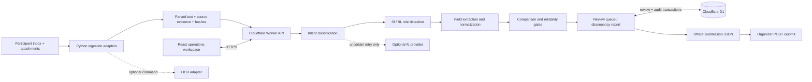

# CargoGuard | Shipping Document Verification

Evidence-backed shipping document verification for the Averis × Monash Hackathon 2026.

CargoGuard is a full-stack operations workspace: classify a mixed inbox, identify a Shipping Instruction (SI) and draft Bill of Lading (BL), compare seven normalized fields, resolve exceptions with a reviewer, and export the official submission format. The deployed demonstration processes the complete **520-message synthetic participant dataset** and **250 attachments**. This GitHub repository contains the reusable source; official data, copied attachments, and generated exports are excluded and must be imported locally. The original supplied ZIPs and documents are unchanged. No private reference answers or dataset generator code are used.

**Live demo:** [CargoGuard](https://cargoguard-shipping-verify.xiongrunxin.chatgpt.site)

**Public production health:** [API health](https://cargoguard-shipping-verify.xiongrunxin.chatgpt.site/api/health)

The frozen-scoring build was published to Cloudflare Workers with D1 through Sites on 19 September 2026. Production checks verified all 520 emails, all 250 original attachment hashes, persistent review/audit writes, and an exported submission identical to the officially evaluated baseline. See [the production verification record](docs/DEPLOYMENT.md) for browser checks, deployment details, and the embedded-browser download limitation.

**Source:** [GitHub repository](https://github.com/forlorinna/CargoGuard-AI)

The product and package identifier are **CargoGuard** and `cargoguard`. The recommended repository name is `cargoguard`; the current source link remains valid until an intentional repository rename. The existing production domain remains the competition demo URL. A future owned custom domain may use a `cargoguard` subdomain; no domain purchase, DNS change, or URL migration is required for this release. See [branding and repository hygiene](docs/BRANDING.md) for the frozen-engine audit and retained hosting integration.

The final branding release (version 3) passed TypeScript, 15 engine tests, 14 production API checks, and full production smoke checks on 20 September 2026 (Asia/Shanghai). All frozen engine hashes, the evaluated submission, and earlier evaluation/deployment records are unchanged.

**Measured organizer-evaluator result (19 September 2026): final score 1.0 / 1.0 across all 520 participant emails.** End-to-end: 46/46; Stage-1 Macro-F1: 1.0; Stage-3 Defect-F1: 1.0; review escalation precision/recall/F1: 1.0. These are actual `/submit` responses from the unmodified organizer service, run natively with Python because Docker/WSL were unavailable. This is a result on the supplied dataset, not an unseen-data or production accuracy claim. See [the evaluation log](docs/EVALUATION.md) and [returned scoreboard](docs/evaluation/001-baseline-score.json).

## Product

- **Dashboard:** actual processing totals, inbox composition, and exception list.
- **Smart inbox:** five categories, routing evidence and heuristic confidence, search, category/status filters, and pagination. No fabricated received times.
- **Verification workspace:** SI and BL side by side; seven field results; source quotes, line/page/table/sheet locations, original attachment links, and SHA-256 provenance.
- **Human review:** inspect evidence, edit extracted values or category, reject or confirm results, retry unresolved cases, and preserve corrections across reloads. Incomplete values and missing/wrong source documents cannot be finalized.
- **Reports:** official submission JSON, detailed discrepancy JSON, and durable review/processing audit history.
- **Processing view:** explains each real processing stage and the active local fallback.

The seven fields are `shipper`, `consignee`, `notify_party`, `port_of_loading`, `port_of_discharge`, `container_count`, and `gross_weight_kg`. The SI is always the reference.

## Architecture and cloud usage



The public frontend and same-origin `/api/*` backend run on **Cloudflare Workers through Sites**. Static source attachments are served as Worker assets. **Cloudflare D1** persists human review revisions and audit events; Drizzle migrations create the schema at deployment. Binary parsing runs as the reproducible Python ingestion step, before building the Worker, avoiding Python/native PDF dependencies inside the edge runtime. Classification, extraction, normalization, comparison, review validation, retry, and export all run in the backend, not just the browser.

This is a public **synthetic-data demo**. Each visitor receives an unguessable, HttpOnly, SameSite session cookie and a separate D1 workspace. Reloading retains that visitor's reviews; another visitor cannot alter them through their own session. Cookies last 30 days. Reviewer names are self-declared, not authenticated identities. Do not use this public deployment for real customer documents without organization authentication, access controls, retention policies, rate limiting, and secure object storage.

## Exact stack

| Layer | Technology |
|---|---|
| Frontend | React 19.2.6, TypeScript 5.9.3, custom responsive CSS, Lucide React 1.31 |
| Full-stack framework | Vinext 1.0.0-beta.5, Vite 8.0.13; Next.js-compatible App Router |
| Hosting / API | Cloudflare Workers, Wrangler 4.92.0, Sites |
| Persistent storage | Cloudflare D1 SQLite; Drizzle ORM 0.45.2 / Drizzle Kit 0.31.10 |
| Ingestion | Python 3, pypdf, python-docx, openpyxl |
| Validation | Node built-in test runner, assert, esbuild for TypeScript test/CLI bundles |

`package-lock.json` pins the JavaScript dependency tree. Python version constraints are in `requirements.txt`.

## AI and reliability

The default classifier is a **local intent ensemble**: vector similarity against independently curated intent descriptions, current-message action signals, subject context, and attachment context. It discards forwarded boilerplate and common stop words. It is not an LLM or a trained embedding model; confidence is an uncalibrated heuristic. Decisions never depend on an email ID or private labels.

An optional **chat-completions-compatible AI adapter** can assist uncertain classifications on Retry. Configure `AI_BASE_URL`, `AI_API_KEY`, and `AI_MODEL` server-side. It only accepts allowed category enums and a verifiable quote from the current email. Timeouts, invalid output, unavailable keys, and unsupported evidence retain the local result with a review reason. It does not invent document fields or replace missing values. The external provider path is implemented but has not been exercised with a real API key.

Document extraction aligns semantic label synonyms and retains supporting evidence. Normalization handles capitalization, whitespace, punctuation, company/address layout, optional port codes, grouped numbers, kilograms, metric tonnes, and pounds. Different company/address tokens remain different; there is no fuzzy company merge. Conflicting explicit port codes remain discrepancies. Unsupported numeric ambiguity, duplicate conflicting values, and placeholders become review cases. No arbitrary weight tolerance is applied.

Optional `OCR_COMMAND` accepts a PDF path and returns UTF-8 text. The ingestor runs it without a shell. OCR-derived text remains review-required. No OCR engine or external vision service is silently assumed to be configured.

## Project structure

```text
app/                 React UI and Worker API routes
lib/                 classification, extraction, normalization, comparison,
                     pipeline, AI adapter, human review, reporting, D1 store
db/                  schema definitions
drizzle/             versioned D1 migrations
data/README.md        local data preparation instructions
data/corpus.json      generated parsed corpus and evidence (ignored)
public/documents/    generated byte-identical attachment copies (ignored)
scripts/ingest.py     read-only binary ingestion
scripts/process.mjs  reproducible complete-dataset processing
scripts/evaluate.py  official POST /submit adapter
scripts/test*.mjs     unit and API test runners
tests/               general behavior and dataset-schema tests
exports/             generated submission, reports, verification results (ignored)
docs/                inspection notes and five-minute demo guide
```

## Local setup

Use **Node.js 22.13 or newer, x64**, and Python 3. On Windows ARM, use the x64 Node build under Windows emulation because the installed Workerd version has no Windows ARM64 binary. Standard macOS/Linux supported architectures can use their native Node build.

Clone the source and obtain the official participant bundle separately from the organizers. Prepare a local folder containing its `inbox/` and `attachments/` directories; keep that folder outside the repository. Reference answers and generator code are not needed and must not be used.

From the project root, replacing the example participant-bundle path with your own:

```sh
npm ci
python -m pip install -r requirements.txt
python scripts/ingest.py --source /path/to/participant-bundle
npm run process:dataset
npm run build
npm run db:migrate
npm run dev
```

Open `http://localhost:5173`. A fresh GitHub clone must complete ingestion before building, testing, or starting the app. The original development workspace already has the corpus, so it does not need re-ingestion. D1 data lives in ignored `.wrangler/state`. `npm run db:migrate` records applied migrations and is safe to run again. A Python virtual environment is recommended; `.venv/`, `venv/`, and `env/` are ignored.

For a built Worker preview:

```sh
npm start -- --port 8787
```

## Environment variables

Copy `.env.example` to `.env` only when configuring integrations. The default needs no secrets. Keep both files' variable names aligned and never commit `.env`.

| Variable | Default / meaning |
|---|---|
| `AI_BASE_URL` | Empty; optional HTTPS chat-completions provider API base |
| `AI_API_KEY` | Empty; provider secret, server only |
| `AI_MODEL` | Empty; provider model ID |
| `OCR_COMMAND` | Empty; optional ingestion-only OCR executable |
| `TEST_URL` | `http://localhost:5173`; API test target |

For local Worker secrets, use ignored `.dev.vars` with the three AI settings; for hosted secrets, use Sites environment-variable controls. Never put credentials in client code, `.openai/hosting.json`, or source data. `OCR_COMMAND` is an environment variable for the Python process, not the browser.

## Process the official dataset

The full corpus is processed without per-email hard-coded results:

```sh
npm run process:dataset
```

Outputs: `exports/submission.json`, `exports/cases.json`, and `exports/processing-summary.json`. The CLI always produces a fresh machine-only baseline. The UI/API export includes the current visitor's saved human reviews.

To re-ingest a separately extracted **participant bundle**, preserving its originals:

```sh
python -m pip install -r requirements.txt
python scripts/ingest.py --source /path/to/sdoc-hackathon-bundle
npm run process:dataset
npm run build
```

Input must have `inbox/*.json` and `attachments/`. All referenced TXT/PDF/DOCX/XLSX files are parsed, hashed, and copied. Missing/unreadable files are not fabricated. Only inbox records and referenced attachments are read; reference answers and generator code are never opened. Re-ingestion updates the application copy, not the input folder. Dataset ingestion is a CLI operation in this version, not a live email connector or web upload feature.

## Official evaluation compatibility

Every inbox ID has exactly these five keys:

```json
{
  "email_001": {
    "category": "BL_COMPARISON",
    "status": "OK",
    "review_reason": null,
    "has_defect": false,
    "defect_fields": []
  }
}
```

Categories: `BL_COMPARISON`, `SI_REQUEST`, `INVOICE_QUERY`, `GENERAL`, `SPAM`. Comparison statuses: `OK`, `MISMATCH`, `NEEDS_REVIEW`. Review reasons: `wrong_doc_type`, `missing_attachment`, `unreadable`, `missing_value`.

The public guide distinguishes **requests to send a future draft** from **missing expected attachments**. The former display `AWAITING_DOCUMENTS` in CargoGuard, but export official `OK` with no defect; this does **not** mean their documents were verified. Explicit missing attachments export `NEEDS_REVIEW`. Operational status is separate from scoring compatibility.

An organizer can run the supplied evaluation distribution with:

```sh
docker compose up --build
```

It serves inbox data on port 8080 and keeps reference answers server-side. Participants should only use the public `/emails`, `/attachments`, `/sample_submission`, and `/submit` endpoints; do not open reference files or enable judge-only answer endpoints.

Submit your predictions once that service is available:

```sh
python scripts/evaluate.py --url http://localhost:8080 --runtime docker --note "Describe the engine change or baseline being evaluated."
```

Use `--runtime native-python` when running the organizer service without Docker, or `--runtime remote` for an organizer-hosted API. The adapter verifies `/health`, checks that submission IDs exactly cover the public `/emails` inbox, and then calls `/submit`. Each attempt creates an ignored timestamped folder under `exports/evaluation-runs/` containing its submission snapshot, returned score when available, and run record with the change note, source revision, engine hashes, submission hash, runtime, and outcome. It updates `exports/official-score.json` only after a successful validated response; a failed attempt leaves any previous successful score unchanged.

The official score uses 50% end-to-end defect detection, 30% classification macro-F1, and 20% defect F1; reliability is separately reported. Two real evaluations returned **1.0** for all these axes and the final score. Docker and WSL were unavailable, so the organizer's unchanged FastAPI application and scoring module ran in an isolated Python environment on `127.0.0.1:8080`. Their hashes match the original ZIP. Only the organizer service consumed its opaque reference data internally; CargoGuard did not inspect labels, access the judge endpoint, or use generator code. Docker-container validation itself remains unperformed. Native-service reproduction and the full run history are documented in [docs/EVALUATION.md](docs/EVALUATION.md).

## Tests and observed results

```sh
npm test
npm run typecheck
npm run test:api
```

Start the app before API tests. They use disposable, isolated synthetic-data sessions.

- **15 engine tests passed**: units, label synonyms, address preservation, misleading subjects, forwarded content, source types, exact discrepancy fields, conflicting values/codes, missing data, human review validation, and all-ID submission schema.
- **14 API checks passed**: health, complete inbox, reject/confirm, durable audit, stale-revision protection, missing-source guards, retry, reprocessing preservation, cross-origin guard, export, and visitor isolation.
- Complete corpus: **520 emails, 250 attachments, 220 comparison requests**.
- Machine outcomes: **63 matching pairs, 46 discrepant pairs, 91 awaiting-document requests, 20 review cases, 300 other-category messages**.
- Review reasons: **5 wrong document types, 5 missing attachments, 5 unreadable pairs, 5 missing values**.
- The processing counts above are distinct from the measured organizer scoreboard: final **1.0**, classification Macro-F1 **1.0**, defect F1 **1.0**, end-to-end **46/46**, and review escalation **20/20** with precision/recall/F1 **1.0**. Confidence values shown in the UI remain uncalibrated heuristics.

These results were recorded with the complete participant dataset. The full-corpus engine check and API suite require that dataset to be ingested first. Running the commands generates `exports/api-test-results.json` and `exports/processing-summary.json` locally; generated reports are not tracked by Git. Browser workflow and deployment checks are recorded in `docs/VERIFICATION.md`.

## Deployment

The project is registered with Sites in `.openai/hosting.json`; reuse its existing `project_id`. It declares the logical `DB` binding. Sites provisions D1, applies the checked-in Drizzle migrations, and publishes the Worker and static assets under one HTTPS origin.

1. Import the participant data locally, then run tests, typecheck, and `npm run build`.
2. Keep `.openai/hosting.json`, source, lockfile, and migrations in the repository. Exclude `.env`, `.dev.vars`, `.wrangler`, `work`, and `node_modules`.
3. Through the authenticated Sites integration, publish this existing project. Commit and push the exact source revision to its configured Sites repository.
4. Package `dist/` with `dist/.openai/hosting.json` and `dist/.openai/drizzle/`. Save that exact revision and build as a Site version, then deploy it with public access as requested for the hackathon.
5. Wait for the terminal deployment result. Use the returned URL for the frontend; append `/api/health` for the backend health endpoint.
6. Configure optional AI secrets through Sites environment controls and redeploy if needed. The default local engine does not need them.

Production currently uses no configured runtime secrets or external AI keys. The demo corpus is bundled with the Worker; D1 stores per-visitor review overrides and audit events, rather than a second copy of all inbox records. A fresh visitor gets the complete machine baseline; review changes remain scoped to that visitor's cookie. No private evaluator files or evaluator service are deployed.

For read-only production checks, set `TEST_URL` to the public HTTPS URL and run `npm run test:production`. This checks the homepage, assets, D1 health, all attachment hashes, and exact baseline submission equivalence. `npm run test:api` additionally creates isolated test sessions and exercises real review/audit writes. Both require local participant data to have been ingested; keep generated reports in ignored `exports/`.

Cloud infrastructure is meaningful: verification/review APIs execute server-side, D1 persists workflow state, and original synthetic evidence is served over HTTPS. It is not a static dashboard with fake backend results.

### Source repository hygiene

The default source branch is `main`. `.gitignore` excludes environment values, credentials, dependency folders, Python environments, build output, local databases, participant data, copied documents, and generated exports. `.env.example` contains variable names with empty values only. Versioned SQL migrations and `build/` source tooling are required and remain tracked. Do not add official archives or generated data with `git add -f`. Build the deployment artifact locally after ingestion; a source-only remote build also needs an authorized data-import step.

## Limitations and next steps

- External AI and OCR adapters are optional and untested against a real paid provider in this run. Image-only/corrupt PDFs deliberately enter review.
- The label-based extractor supports the supplied layouts. Arbitrary complex real-world layouts, handwriting, multilingual free text, and unrecognized port aliases can require review. Extend parsers using new source evidence and an independently labeled validation set.
- Replacement/missing documents must currently be re-ingested through the CLI and redeployed. The UI cannot upload a replacement binary attachment. Existing finalized reviews must be reconsidered after changing the dataset; use a fresh session for a new dataset version.
- The corpus is compiled into the Worker. This is suitable for 520 synthetic emails, not unlimited production mail volume. Add queues, ingestion services, and private R2 storage for scale.
- Public demo reviewer names are not verified identities. Add authenticated team workspaces, role-based review permissions, rate limits, and retention controls before operational use.
- Review history records before/after source evidence, but is an application audit trail, not a cryptographically tamper-evident ledger. The UI shows the latest 200 audit events.
- No live Outlook/Gmail connection, actual outbound email sending, or automatic BL amendment is claimed.
- The maximum measured score is specific to the supplied 520-email dataset. It does not establish performance on unseen shipping documents. The organizer service was exercised natively, not inside Docker.

Roadmap: authenticated team review; secure document uploads and versioning; OCR/vision integration with bounding-box evidence; calibrated classifier trained on independently labeled emails; asynchronous ingestion and processing queues; larger unseen-document evaluation; reviewer impact and turnaround analytics.

## Hackathon submission checklist

The participant handbook lists the preliminary deadline as **22 September 2026, 12:00 PM**, with no timezone stated. Confirm timezone and submission details in the organizer's linked rules document, which was not accessible during this run.

- Confirm the public app URL and `/api/health` on a judge-accessible connection.
- Preserve the measured evaluator results in `docs/evaluation/`; rerun `/submit` after any engine change or on any new organizer dataset. Repeat inside Docker when a Docker host is available.
- Review unresolved cases without inventing missing information.
- Include source, README, architecture explanation, and exported `submission.json` as required by the final rules.
- Prepare the 5-minute demonstration in `docs/DEMO.md`; verify requirements for slides/video/team details in the organizer rules.
- If pitching external AI or OCR, configure and demonstrate it first; otherwise present the local hybrid engine and human review honestly.
