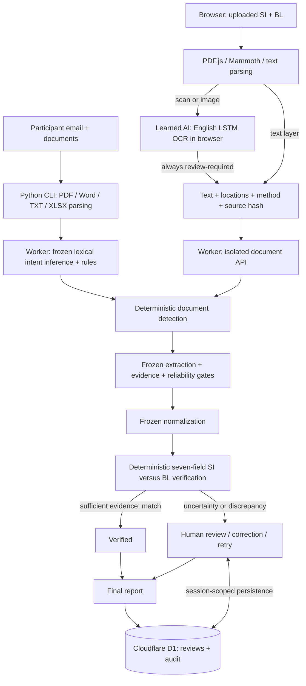

# CargoGuard | Shipping Document Verification

Evidence-backed shipping document verification for the Averis × Monash Hackathon 2026

**[Live CargoGuard demo](https://cargoguard-shipping-verify.xiongrunxin.chatgpt.site)** · **[API health](https://cargoguard-shipping-verify.xiongrunxin.chatgpt.site/api/health)** · **[Source](https://github.com/forlorinna/CargoGuard-AI)**

CargoGuard routes a mixed shipping inbox, compares Shipping Instructions (SI) with draft Bills of Lading (BL), exposes discrepancies and evidence, and records human corrections. Its frozen engine achieved **1.0 / 1.0 on the organizer evaluator across all 520 participant emails**. This is an organizer-code benchmark result, **not the hackathon judges’ final score or a guarantee on unseen documents**.

## Problem and solution

Shipping teams receive document checks alongside instruction requests, invoice questions, operational notices, and spam. Incorrect parties, ports, container counts, or weights can lead to amendments and shipment delays. Missing or unreadable information must be escalated rather than treated as a match.

CargoGuard classifies the inbox, identifies the SI and BL by content, extracts seven fields with source evidence, normalizes conservatively, compares against the SI, and supports review, correction, retry, and report export. The seven fields are shipper, consignee, notify party, loading port, discharge port, container count, and gross weight in kilograms.

## Key features and demonstration

1. **Dashboard → Open a discrepancy:** inspect a real participant case and its source evidence.
2. **Smart Inbox:** filter all five categories and inspect the routing signal and reasons.
3. **Verification:** compare all seven fields, open source snippets and original documents.
4. **Human Review:** correct only supported values, reject or confirm, and retain an audit trail.
5. **Reports:** export the exact official submission schema and discrepancy report.
6. **Upload documents:** try the text-PDF/Word-table example, then the image-only scanned-PDF example. Real OCR runs on the scan; its result requires human confirmation.

Uploaded pairs have a separate report and never enter the official 520-email submission. See the [five-minute demo guide](docs/DEMO.md).

## AI + deterministic hybrid architecture

**AI where interpretation is needed. Deterministic verification where accuracy and auditability are required.**

- **Active learned AI:** Tesseract English LSTM OCR recognizes text in uploaded scans and images, in a browser worker. Model and runtime assets come from locked packages and are served from CargoGuard’s own origin. Documents are not sent to an external AI provider.
- **Inbox inference:** the frozen local classifier combines token-count cosine similarity to curated intent descriptions with document/action rules. It is a lexical vector-space ensemble, **not a trained embedding model or an LLM**.
- **Deterministic verification:** document-role detection, field extraction, evidence capture, normalization, comparison, review validation, and official reporting remain unchanged.
- **Optional LLM adapter:** an existing server-configured classifier can assist uncertain retries, subject to category and exact-quote validation. No provider credentials are configured; this path is not claimed as active or provider-tested.

The official benchmark used the frozen local pipeline. New uploaded-scan OCR is separately validated and does not improve or reinterpret that benchmark. The [AI and document audit](docs/AI-AND-DOCUMENTS.md) explains every component, confidence signal, failure path, and limitation.

## Architecture diagram



The [standalone Mermaid source](docs/architecture.mmd) includes the unconfigured optional LLM path and is reusable in a presentation.

## Technology stack and cloud infrastructure

| Layer | Actual implementation |
|---|---|
| UI | React 19, TypeScript, Lucide, responsive custom CSS |
| Application / API | Vinext and Vite, deployed to Cloudflare Workers through Sites |
| Persistence | Cloudflare D1, Drizzle schema/migrations; prepared statements and atomic review/audit writes |
| Official dataset ingestion | Python, pypdf, python-docx, openpyxl |
| Browser document parsing | PDF.js 6.3.289 and Mammoth 1.12.3 |
| Learned OCR | Tesseract.js 7.0.0, WebAssembly core, English LSTM model |
| Validation | TypeScript, Node test runner, API integration, browser workflows, production smoke checks, organizer `/submit` |

The Worker serves the application and same-origin APIs. The **520-email corpus and 250 original participant attachments are bundled into the deployment**, not duplicated into an inbox table. D1 stores session-scoped review results and audit events. Uploaded-pair records use separate `upload_` identifiers in the existing review storage; official exports select only the original inbox IDs.

Visitors receive an HttpOnly, SameSite session cookie. Reloading retains their review state; other visitors have separate workspaces. For uploads, parsing/OCR happens on the device; bounded extracted text and evidence go to the Worker and D1. Original uploaded bytes stay on the device. **No R2 storage, queue service, external OCR service, or active LLM service is claimed.**

Storage errors are surfaced; stale review revisions are rejected; retries preserve finalized human work. Scaling beyond the demo would require authenticated organizations, durable private original-file storage, queues, rate limits, retention controls, and corpus storage outside the Worker bundle.

## Human-in-the-loop reliability

Missing, wrong-type, unreadable, or ambiguous documents enter review. Requests for a future draft appear as **Awaiting documents**, not completed verification. The official export maps those requests to the organizer-compatible `OK` status without asserting verified documents.

Routing confidence is an **uncalibrated heuristic signal**, not a probability. Extracted fields show real source snippets, locations, normalized values, and issues. OCR recognition scores are shown as engine signals only. Every OCR result requires review, even at a high score.

Uploaded-pair confirmation requires an explicit check against originals, a reviewer name, an evidence note, recognized SI/BL sources, and all seven valid values. D1 records before/after evidence and corrections. Names are self-declared; this demo does not authenticate professional reviewers.

## Advanced document support

| Input | Working path | Boundaries |
|---|---|---|
| Text PDF | Python participant ingestion; PDF.js browser upload | Page text and line evidence; complex layouts may require review |
| DOCX / Word | Python paragraphs/tables; Mammoth browser paragraphs/table cells | Legacy `.doc` unsupported; no page-number reconstruction |
| Scanned PDF | Browser PDF rendering followed by English LSTM OCR | Always human review; no change to frozen official scanned cases |
| PNG / JPEG | Browser decoding followed by English OCR | Printed English; handwriting and multilingual recognition not claimed |
| TXT / XLSX | TXT in CLI and upload; XLSX in participant CLI | XLSX browser upload is not implemented |

Upload limits: **8 MB/file**, **10 PDF pages**, **4 OCR pages/document**, **16-megapixel images**, **80,000 extracted characters/document**, **240 KB API payload**, and **10 saved pairs/session**. Word archive expansion is bounded. Failed or partial extraction never silently becomes a verified result. Replacing originals requires a fresh extraction; Retry rechecks saved text.

The small examples in `public/demo/` are original synthetic fixtures, not copied organizer data. Their scan has no text layer. See [support and test details](docs/AI-AND-DOCUMENTS.md).

## Official evaluation results

| Organizer-returned metric | Measured result |
|---|---:|
| Dataset | 520 emails |
| End-to-end | 1.0 — 46/46 |
| Stage-1 Macro-F1 / accuracy | 1.0 / 1.0 |
| Stage-3 Defect-F1 / precision / recall | 1.0 / 1.0 / 1.0 |
| Stage-3 field F1 / exact match | 1.0 / 1.0 |
| NEEDS_REVIEW precision / recall / F1 | 1.0 / 1.0 / 1.0 |
| Expected / predicted review cases | 20 / 20; 5/5 caught per reason group |
| Final weighted evaluator score | **1.0 / 1.0** |

Weights: 50% end-to-end, 30% classification Macro-F1, 20% defect F1. Stage-3 counts 200 non-review comparison requests, including requests awaiting documents; this is not 200 verified pairs.

These are real organizer `/submit` responses. Docker is unavailable here, so the **unmodified organizer service ran natively in Python**, with private references consumed only inside the organizer process. No reference labels, judge endpoint, or generator code were inspected. Docker-container validation remains unperformed.

[Evaluation history and actual score files](docs/EVALUATION.md) · [Verification record](docs/VERIFICATION.md) · [Production deployment evidence](docs/DEPLOYMENT.md)

**Organizer results, local tests, and production checks are separate evidence categories.** Unit tests do not establish the official score; production smoke checks establish deployment behavior, not unseen-document accuracy.

## Local setup

Use Node 22.13+ and Python 3.12+. On Windows, use x64 Node for the Workerd preview runtime. Obtain the official participant bundle separately and extract its `inbox/` and `attachments/` outside the repository. Do not import the organizer's private/reference data.

```sh
npm ci
python -m pip install -r requirements.txt
python scripts/ingest.py --source /path/to/participant-bundle
npm run process:dataset
npm run build
npm run db:migrate
npm run dev
```

Local development runs at `http://localhost:5173`. For a built Worker preview: `npm start -- --port 8787`. A fresh clone needs participant ingestion before the full application build/tests. OCR assets are prepared automatically from locked packages during development/build; no OCR account or API key is needed.

The default app needs no secrets. Empty declarations in `.env.example` document optional `AI_BASE_URL`, `AI_API_KEY`, `AI_MODEL`, and ingestion-only `OCR_COMMAND`. Use ignored `.env`/`.dev.vars` locally and Sites environment controls for hosted secrets. Never put keys in source, browser code, or hosting metadata.

## Official dataset / evaluator reproduction

An organizer with Docker starts the supplied distribution using `docker compose up --build`. CargoGuard then runs:

```sh
npm run process:dataset
python scripts/evaluate.py --url http://localhost:8080 --runtime docker --note "Reproduce frozen CargoGuard submission."
```

Use `--runtime native-python` when reproducing the service as run here. The adapter checks health and complete public inbox coverage, submits fresh predictions, and preserves the real response and run metadata. Failure never creates a substitute score. Native-service setup and the private-data boundary are documented in [EVALUATION.md](docs/EVALUATION.md).

```sh
npm run typecheck
npm test
npm run test:documents
npm run verify:frozen
npm run test:api
npm run test:documents:api
```

Start the app before API tests. Set `TEST_URL` to the public HTTPS URL for production API checks, and run `npm run test:production` for homepage/assets, D1 health, all 520 cases, 250 attachment hashes, and exact baseline export equivalence. Integration tests create isolated synthetic sessions. The freeze check protects the checkpointed core files and evaluated submission bytes.

## Deployment and repository safety

`.openai/hosting.json` is **required** by the active Sites/Cloudflare deployment; it contains the project identity and logical `DB` binding, not credentials. Keep it, migrations, source, and lockfile. Build after local participant ingestion, push the exact source to the configured Sites repository, package `dist/`, save that source/artifact version, and deploy it with the existing public audience. Runtime/model files are generated build assets and excluded from Git.

GitHub `main` contains source, documentation, evaluation evidence, and small original demo fixtures. It excludes secrets, actual environment values, dependency/virtual-environment folders, build output, full official archives, participant copies, and generated exports. All frozen engine hashes and earlier evaluation/deployment records are retained. Product/package identifier: **CargoGuard** / `cargoguard`. Recommended repository name: `cargoguard`; the existing GitHub and public URLs remain valid until an intentional rename or domain migration.

## Challenges, limitations, and roadmap

The main challenges were separating current email intent from forwarded content, preserving entity/address differences while normalizing formatting, distinguishing future drafts from missing evidence, and recording real evaluator results without using private answers. Browser OCR adds document coverage while keeping the measured engine frozen and the small Worker free of native parsing dependencies.

This is a **public synthetic-data prototype**. It lacks organization authentication, verified reviewer identities, global abuse rate limiting, automatic data retention expiry, and durable uploaded original-file storage. Client-extracted text is not independently re-parsed on the server. Per-session limits do not prevent multi-session abuse. Confidence is uncalibrated; OCR can misread; unrecognized layouts require review. There is no live mailbox connector, actual outbound email sending, or automatic BL amendment.

The embedded browser has previously failed to emit a download-completion event for exports; API report contents are independently checked. Docker-container reproduction and real-provider LLM/OCR-command testing are not claimed.

Roadmap: authenticated team workspaces, private original-file storage and signed provenance, asynchronous ingestion, controlled retention and abuse limits, broader language/layout testing, calibrated confidence, and independent unseen-document evaluation.

## Team / hackathon submission

Prepared for the **Averis × Monash Hackathon 2026**. Team membership is not invented in this repository. Before submission, supply the registered team details, confirm the organizer’s deadline/timezone and required deliverables, and rehearse the [demo](docs/DEMO.md). The supplied handbook lists preliminary submission on 22 September 2026 at 12 PM without a timezone; confirm the current rules directly with the organizers. Include the working public link, source, frozen submission, and required pitch/video material. Technical benchmark performance does not determine the full judging score.
